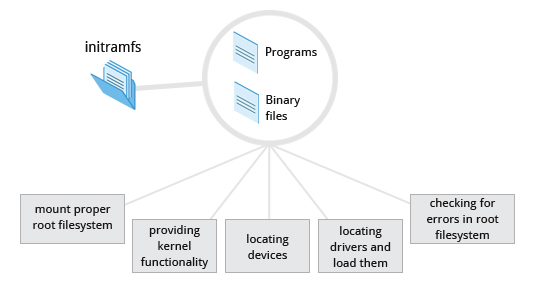

# Linux Boot Process

1. __BIOS/POST__ Basic Input/Output System or Power On Self Test initializes the hardware, including the screen and keyboard, and tests the main memory. 
2. __Boot Loader__ The boot loader is usually stored on one of the hard disks in the system, either in the boot sector (for traditional _BIOS/MBR_ systems) or the EFI partition (for more recent (Unified) Extensible Firmware Interface or _EFI/UEFI_ systems). 
    -  A number of boot loaders exist for Linux, the most common ones are _GRUB_ (for GRand Unified Boot loader), _ISOLINUX_ (for booting from removable media), and _DAS U-Boot_ (for booting on embedded devices/appliances).
    - When booting Linux, the boot loader is responsible for loading the kernel image and the initial RAM disk or filesystem (which contains some critical files and device drivers needed to start the system) into memory.
    - At first stage, boot loader finds partition table and try to locate second stage boot loader i.e. GRUB
    - The second stage boot loader resides under `/boot`. A splash screen is displayed, which allows us to choose which operating system (OS) to boot. After choosing the OS, the boot loader loads the kernel of the selected operating system into RAM and passes control to it.
3. __Initial RAM disk - initramfs image__ The initramfs filesystem image contains programs and binary files that perform all actions needed to mount the proper root filesystem.
    - The mount program instructs the operating system that a filesystem is ready for use, and associates with __the mount point__. If this is successful, the initramfs is cleared from RAM and the init program on the root filesystem (`/sbin/init`) is executed.

4. __The Linux Kernel__ The boot loader loads both the kernel and an initial RAM–based file system (initramfs) into memory, so it can be used directly by the kernel. 

    - When the kernel is loaded in RAM, it immediately initializes and configures the computer’s memory and also configures all the hardware attached to the system. This includes all processors, I/O subsystems, storage devices, etc. The kernel also loads some necessary user space applications.
    - Once the kernel has set up all its hardware and mounted the root filesystem, the kernel runs /sbin/init.
    - This then becomes the initial process, which then starts other processes to get the system running. Most other processes on the system trace their origin ultimately to init.
    - Besides starting the system, init is responsible for keeping the system running and for shutting it down cleanly. 
    - One of its responsibilities is to act when necessary as a manager for all non-kernel processes.

5. __Startup Alternative__ _SysVinit_ viewed things as a serial process, divided into a series of sequential stages. Each stage required completion before the next could proceed. Thus, startup did not easily take advantage of the parallel processing that could be done on multiple processors or cores.

    - Furthermore, shutdown and reboot was seen as a relatively rare event; exactly how long it took was not considered important. This is no longer true, especially with mobile devices and embedded Linux systems.
    - The two main alternatives developed were: 
        - __Upstart:__ Developed by Ubuntu and first included in 2006. Adopted in Fedora 9 (in 2008) and in RHEL 6 and its clones.
        - __systemd__: Adopted by Fedora first (in 2011). Adopted by RHEL 7 and SUSE. Replaced Upstart in Ubuntu 16.04

6. __systemd__ - `systemd` Systems with `systemd` start up faster than those with earlier `init` methods. This is largely because it replaces a serialized set of steps with aggressive parallelization techniques, which permits multiple services to be initiated simultaneously.

    - One thing to note is that `/sbin/init` now just points to `/lib/systemd/systemd`; i.e. `systemd` takes over the `init` process.