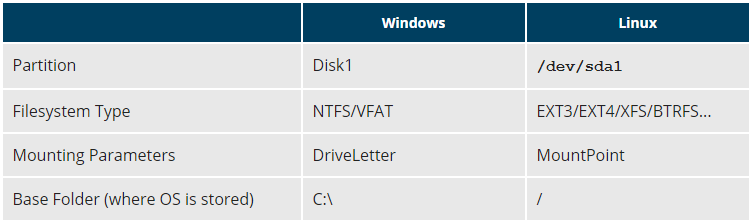

# File System

Different types of filesystems supported by Linux:

- Conventional disk filesystems: ext2, ext3, ext4, XFS, Btrfs, JFS, NTFS, etc.
- Flash storage filesystems: ubifs, JFFS2, YAFFS, etc.
- Database filesystems
- Special purpose filesystems: procfs, sysfs, tmpfs, squashfs, debugfs, etc.

## Filesystem Hierarchy Standard

- You can look this document for more details[Linux Filesystem](./Documents/Linux_File_System_fhs_3-0.pdf)
- Linux systems store their important files according to a standard layout called the Filesystem Hierarchy Standard (FHS), which has long been maintained by the Linux Foundation.

